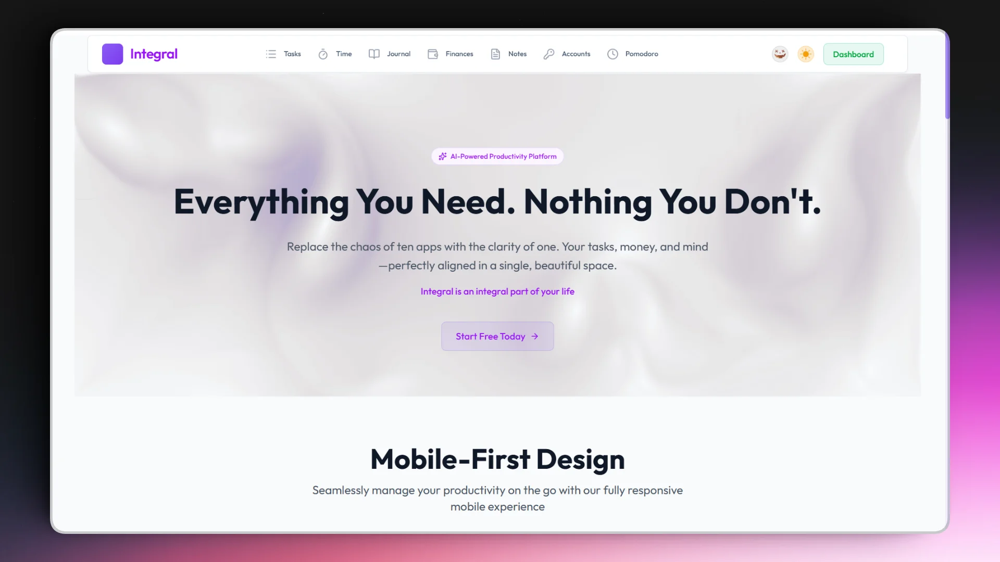

<div align="center">

# Integral



<p align="center">
  
  
  
  
  
</p>

<p align="center">
  Built with React, TypeScript, and Supabase
</p>

<p align="center">
  <strong>A comprehensive productivity suite for modern professionals</strong>
</p>
</div>

---

## Overview

**Integral** is a comprehensive personal productivity suite that brings together task management, note-taking, time tracking, journaling, and budgeting in one unified platform. Built with a modern glass morphism design, real-time sync, and multiple themed modes for a personalized experience.

## Live Demo

Check out the live application:

<div align="center">
  <a href="https://integral-productivity.vercel.app/"></a> <a href="https://integral-productivity.netlify.app/"></a>
</div>

- **Vercel:** https://integral-productivity.vercel.app/
- **Netlify:** https://integral-productivity.netlify.app/

## Demo Account

Use these credentials to explore the platform:

- **Username:** `demo@integral.com`
- **Password:** `integral`

## Key Features

| Module            | Description                                                                               |
| ----------------- | ----------------------------------------------------------------------------------------- |
| **Dashboard**     | Central hub with unified overview of all productivity metrics and quick actions           |
| **Tasks**         | Project-based task management with priorities, due dates, tags, and productivity insights |
| **Notes**         | Rich Lexical editor with folder organization, pinning, favorites, and instant search      |
| **Time Tracking** | Activity logging with detailed session history and persistent floating timer widget       |
| **Pomodoro**      | Customizable focus timer with work/break intervals, session history, and notes            |
| **Journal**       | Daily reflections with calendar navigation, mood tracking, and activity tags              |
| **Budget**        | Multi-currency financial tracking with analytics, budgets, and transaction management     |
| **Accounts**      | Secure credential storage with usage tracking and organized folders                       |

**Built on Modern Tech** - React 19, TypeScript, Supabase real-time database, Tailwind CSS, and Framer Motion animations.

**Seamless Experience** - Glass morphism UI, dark/light themes, Halloween mode toggle, responsive design, and real-time sync across all devices.

**Secure & Private** - Row-level security, encrypted data, and privacy-first architecture with Supabase authentication.

## Technology Stack

| Category               | Technologies                         | Features                                                    |
| ---------------------- | ------------------------------------ | ----------------------------------------------------------- |
| **Frontend**           | React 19.2, TypeScript 5.9, Vite 7.2 | Latest React features, strict typing, lightning-fast builds |
| **Styling**            | Tailwind CSS 4.1, Framer Motion      | Modern utility-first CSS, smooth animations                 |
| **UI Components**      | Radix UI, Custom Glass Morphism      | Accessible primitives, stunning visual effects              |
| **State Management**   | TanStack Query v5, React Context     | Server state sync, optimistic updates                       |
| **Routing**            | React Router DOM v7.9                | Advanced navigation, nested routes, lazy loading            |
| **Backend**            | Supabase (Auth, Database, Storage)   | Real-time subscriptions, PostgreSQL database                |
| **Rich Text**          | Lexical Editor 0.38                  | Advanced text editing, extensible plugins                   |
| **Data Visualization** | Recharts                             | Interactive charts for analytics                            |
| **Forms & Validation** | React Hook Form, Zod 4               | Type-safe validation, optimized performance                 |
| **Development**        | Biome 2.3, Bun                       | Modern linting/formatting, fast package management          |

## Quick Start

### Prerequisites

- Node.js v18+ or Bun (recommended)
- Supabase account and project

### Installation

```bash
# Clone the repository
git clone https://github.com/exyness/Integral.git
cd Integral

# Install dependencies
bun install

# Set up environment variables
cp .env.example .env
# Configure your Supabase credentials in .env

# Start development server
bun dev
```

### Supabase Setup

```bash
# Push database migrations
bunx supabase db push

# Generate TypeScript types (replace with your project ID)
bunx supabase gen types typescript --project-id YOUR_PROJECT_ID > src/integrations/supabase/types.ts
```

**Application will be available at:** `http://localhost:8080`

### Available Scripts

| Command         | Description                          |
| --------------- | ------------------------------------ |
| `bun dev`       | Start development server (port 8080) |
| `bun build`     | Build for production                 |
| `bun build:dev` | Build in development mode            |
| `bun preview`   | Preview production build             |
| `bun lint`      | Run Biome linter                     |
| `bun lint:fix`  | Fix linting issues automatically     |
| `bun format`    | Format code with Biome               |

## Themed Modes

Integral supports multiple visual themes to personalize your experience:

- **Light Mode** - Clean, bright interface for daytime productivity
- **Dark Mode** - Eye-friendly dark theme for low-light environments
- **Halloween Mode** - Seasonal themed experience with custom decorations, animations, and color schemes

Theme preferences are persisted across sessions and apply system-wide to all pages and components.

## Contributing

We welcome contributions! Please follow these steps:

1. **Fork** the repository
2. **Create** a feature branch (`git checkout -b feature/amazing-feature`)
3. **Commit** your changes (`git commit -m 'Add amazing feature'`)
4. **Push** to the branch (`git push origin feature/amazing-feature`)
5. **Open** a Pull Request

### Development Guidelines

- Follow TypeScript best practices
- Maintain consistent code formatting
- Write meaningful commit messages
- Test your changes thoroughly
- Update documentation as needed

## License

This project is licensed under the Apache License 2.0 - see the [LICENSE](LICENSE) file for details.

---

## Highlights

- **Real-time Sync** - All changes sync instantly via Supabase with optimistic updates
- **Responsive Design** - Fully optimized for desktop, tablet, and mobile devices
- **Multiple Themes** - Dark/light mode with system preference detection and seasonal themes
- **Glass Morphism UI** - Modern translucent design with backdrop blur throughout
- **Folder Organization** - Hierarchical folder system across Notes, Accounts, and Tasks
- **Floating Timer Widget** - Persistent draggable timer that works across all pages
- **Virtualized Lists** - High-performance rendering for large datasets

---

<div align="center">

**Built with ❤️ by exyness for productivity enthusiasts**

_Experience the future of productivity with advanced grids, floating widgets, and glass morphism design_

<p>
  <a href="#overview">Overview</a> •
  <a href="#key-features">Features</a> •
  <a href="#technology-stack">Tech Stack</a> •
  <a href="#quick-start">Quick Start</a>
</p>

</div>
